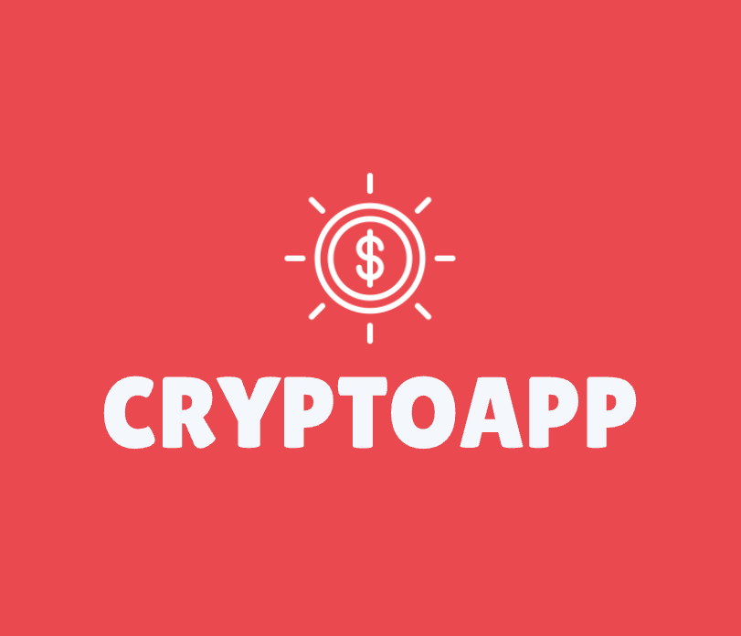

<div align="center">
  
  # CryptoApp - iOS Cryptocurrency Trading App
   <br />
  
  [](https://swift.org)
  [](https://developer.apple.com/ios/)
  [](https://developer.apple.com/xcode/)
  [](LICENSE)
</div>

## 🚀 Overview

CryptoApp is a comprehensive iOS cryptocurrency trading application that provides real-time market data, interactive charts, and seamless trading capabilities. Built with native iOS technologies and integrated with Coinbase Pro API, it offers a professional-grade trading experience with focus on user experience and real-time data synchronization.

## ✨ Key Features

### 🏠 Market Dashboard

- **Real-time Price Updates**: Live cryptocurrency prices with WebSocket connections
- **Interactive Carousel**: Swipeable banner showcasing popular trading pairs
- **Market Overview**: Complete list of USD-paired cryptocurrencies with live pricing
- **Privacy Toggle**: Eye icon to hide/show account balances for privacy
- **Pull-to-Refresh**: Manual refresh capability for latest market data

### 📊 Advanced Charting

- **Multi-timeframe Charts**: Day, Week, Month, 3-Month, Year, and All-time views
- **Interactive Line Charts**: Touch gestures to view specific price points and timestamps
- **Real-time Price Ticker**: WebSocket-powered live price updates
- **Historical Data Visualization**: Candlestick data processing with custom granularity
- **Price Movement Indicators**: Color-coded charts (green for gains, red for losses)

### 💰 Trading Engine

- **Market Orders**: Real-time market order execution with FOK (Fill or Kill) strategy
- **Dual-direction Trading**: Buy and sell functionality with balance validation
- **Currency Conversion**: Live USD to TWD conversion for local currency display
- **Transaction Confirmation**: Double confirmation system for large transactions
- **Balance Validation**: Real-time account balance checking before order execution

### 📈 Portfolio Management

- **Multi-currency Wallet**: Support for Bitcoin, Ethereum, Litecoin, and other major cryptocurrencies
- **Real-time Portfolio Valuation**: Live portfolio value calculation in TWD
- **Account Balance Tracking**: Individual account balances for each cryptocurrency
- **Transaction History**: Complete order history with filtering capabilities

### 📋 Transaction History

- **Comprehensive Order History**: Last 100 transactions with detailed information
- **Advanced Filtering**: Filter by cryptocurrency type and transaction status
- **Real-time Updates**: Automatic history updates after successful trades
- **Transaction Details**: Complete order information including timestamps and amounts

## 🛠 Tech Stack

### Core Technologies

- **Language**: Swift 5.0
- **Framework**: UIKit with MVC + MVVM architecture
- **Minimum iOS Version**: iOS 13.0+
- **Development Tool**: Xcode 14.0+

### Third-Party Libraries

```ruby
# Podfile dependencies
pod 'SwiftLint'           # Code quality and style enforcement
pod 'Kingfisher'          # Async image loading and caching
pod 'MJRefresh'           # Pull-to-refresh functionality
pod 'JGProgressHUD'       # Loading indicators and progress HUDs
pod 'iCarousel'           # Carousel banner implementation
pod 'DGCharts'            # Interactive charting library
pod 'TinyConstraints'     # Auto Layout constraints helper
pod 'Starscream'          # WebSocket client for real-time data
```

### API Integration

- **Coinbase Pro API**: Complete trading functionality
- **Authentication**: HMAC SHA256 signature authentication
- **WebSocket**: Real-time price feeds and market data
- **RESTful Services**: Account management, order execution, market data
- **Exchange Rate API**: USD to TWD conversion

### Architecture Patterns

- **MVVM (Model-View-ViewModel)**: Clean separation of concerns
- **Observer Pattern**: Data binding with custom observable properties
- **Delegation Pattern**: Protocol-based communication
- **Singleton Pattern**: Shared services (CoinbaseService, WebsocketService)

## 🏗 Project Structure

```
CryptoApp/
├── Models/                 # Data models and structures
│   ├── Account.swift      # User account and balance models
│   ├── CurrencyInfo.swift # Cryptocurrency information
│   ├── ExchangeRates.swift # Currency conversion rates
│   ├── Order.swift        # Trading order models
│   └── Profile.swift      # User profile data
├── HomeView/              # Main dashboard interface
│   ├── HomeViewController.swift
│   ├── BannerBalanceTableViewCell.swift
│   └── ProductListTableViewCell.swift
├── MarketChartView/       # Chart and market data interface
│   ├── MarketChartViewController.swift
│   ├── ChartTableViewCell.swift
│   └── HistoryHeaderView.swift
├── FullHistoryView/       # Transaction history interface
│   ├── BuySellViewController.swift
│   ├── FilterOptionViewController.swift
│   └── TransactionTableViewCell.swift
├── WalletView/            # Portfolio management interface
│   ├── ProfileViewController.swift
│   └── CoinAccountTableViewCell.swift
├── Utilities/             # Core services and networking
│   ├── CoinbaseService.swift
│   ├── WebsocketService.swift
│   └── Utils.swift
├── Extensions/            # Swift extensions
│   ├── Double+Extensions.swift
│   ├── String+Extensions.swift
│   └── UIColor+Extensions.swift
└── Resources/             # Assets and configurations
    └── Assets.xcassets/
```

## 🔐 Security Features

- **HMAC SHA256 Authentication**: Secure API request signing
- **API Key Management**: Secure credential handling
- **SSL/TLS Communication**: Encrypted data transmission
- **Sandbox Environment**: Safe testing environment for development

## 📱 User Interface

### Design Principles

- **Native iOS Design**: Follows Apple's Human Interface Guidelines
- **Responsive Layout**: Adaptive layouts for different screen sizes
- **Intuitive Navigation**: Tab-based navigation with contextual actions
- **Visual Feedback**: Loading states, success/error indicators
- **Accessibility**: VoiceOver support and accessibility features

### Key UI Components

- **Custom Table Cells**: Reusable XIB-based cells
- **Interactive Charts**: Touch-responsive price charts
- **Carousel Banners**: Swipeable promotional content
- **Modal Presentations**: Transaction confirmations and filters
- **Navigation Controllers**: Hierarchical navigation flow

## 🚀 Getting Started

### Prerequisites

- Xcode 14.0 or later
- iOS 13.0+ deployment target
- CocoaPods for dependency management
- Coinbase Pro Sandbox API credentials

### Installation

1. **Clone the repository**

   ```
   git clone https://github.com/yourusername/cryptomaster-ios.git
   cd cryptomaster-ios
   ```

2. **Install dependencies**

   ```
   pod install
   ```

3. **Open workspace**

   ```
   open CryptoApp.xcworkspace
   ```

4. **Configure API credentials**

   - Update `CoinbaseService.swift` with your sandbox API credentials
   - Ensure proper API key, secret, and passphrase configuration

5. **Build and run**
   - Select target device or simulator
   - Build and run the project (⌘+R)

### API Configuration

Update the following in `CoinbaseService.swift`:

```swift
private let apiKey = "YOUR_API_KEY"
private let apiSecret = "YOUR_API_SECRET"
private let passPhrase = "YOUR_PASSPHRASE"
```

## 📊 Performance Optimizations

- **Async Image Loading**: Kingfisher for efficient image caching
- **WebSocket Management**: Optimized connection handling
- **Memory Management**: Proper retain cycle prevention
- **Background Processing**: GCD for network operations
- **Data Caching**: Strategic caching of market data

## 🧪 Testing Strategy

- **Unit Testing**: Core business logic testing
- **Integration Testing**: API integration verification
- **UI Testing**: User interface automation tests
- **Manual Testing**: Comprehensive user journey testing

## 🔄 Real-time Features

### WebSocket Implementation

- **Live Price Updates**: Continuous price feed for active trading pairs
- **Connection Management**: Automatic reconnection and error handling
- **Subscription Management**: Dynamic channel subscription/unsubscription
- **Data Processing**: Real-time JSON parsing and UI updates

### Performance Considerations

- **Connection Pooling**: Efficient WebSocket connection management
- **Rate Limiting**: Respectful API usage patterns
- **Error Recovery**: Robust error handling and retry mechanisms

## 📈 Future Enhancements

- [ ] **Advanced Order Types**: Limit orders, stop-loss orders
- [ ] **Technical Indicators**: RSI, MACD, Bollinger Bands
- [ ] **Portfolio Analytics**: Profit/loss tracking, performance metrics
- [ ] **Price Alerts**: Push notifications for price movements
- [ ] **Dark Mode**: System-wide dark theme support
- [ ] **Face ID/Touch ID**: Biometric authentication
- [ ] **Multi-language Support**: Localization for global users

## 📄 License

This project is licensed under the MIT License - see the [LICENSE](LICENSE) file for details.

## Credits

© 2025 Ruby Chu - [@yoon_tech](https://twitter.com/yoon_tech) - dev.rubyc@gmail.com

This project was designed and developed by Ruby Chu as a portfolio piece.

---

<div align="center">
  <p><strong>Built with ❤️ using Swift and iOS Technologies</strong></p>
  <p><em>Showcasing modern iOS development practices and real-time financial data integration</em></p>
</div>
